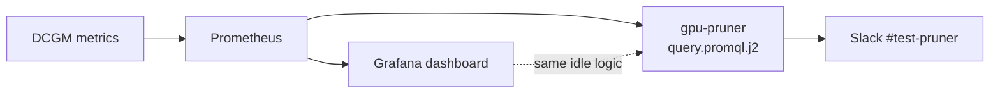

# GPU Pruner Deployment Session - June 11, 2026

## Session Overview

Successfully deployed the gpu-pruner application to the `fuddin-dev` namespace in the `coreweave-waldorf` Kubernetes cluster, configured it to monitor GPU utilization via Prometheus, and enabled Slack notifications and interaction endpoints.

## What is GPU Pruner?

GPU Pruner is an automated tool that:
- Monitors GPU utilization across Kubernetes workloads using Prometheus metrics
- Identifies idle GPUs (< 1% utilization over a 30-minute window)
- Sends notifications to Slack when idle GPUs are detected
- Provides Slack interaction endpoints for users to acknowledge or dismiss alerts
- Can scale down workloads with idle GPUs (when configured in scale-down mode)

## What We Deployed

### Environment Details
- **Cluster**: coreweave-waldorf
- **Namespace**: fuddin-dev
- **Deployment Script**: `./hack/apply-user-namespace.sh`
- **Image**: `ghcr.io/fuddin-bit/gpu-pruner@sha256:14a22b4f93d549a8f4ac426b4450f62890e1ecd5265ecc1fc674f99a60b21729`

### Deployed Resources

1. **Deployment**: `gpu-pruner`
   - 1 replica
   - ServiceAccount: `gpu-pruner`
   - Resources: 250m CPU / 64Mi RAM (requests), 500m CPU / 128Mi RAM (limits)

2. **Services**:
   - `gpu-pruner-dashboard` (ClusterIP): Internal dashboard on port 8080
   - `gpu-pruner-slack` (LoadBalancer): External Slack webhook endpoint on port 3002
     - External IP: `166.19.17.49`
     - Endpoint: `http://166.19.17.49:3002/slack/interactions`

3. **Secret**:
   - `gpu-pruner-slack-webhook`: Contains Slack webhook URL (pre-existing)

### Configuration

```yaml
Args:
  - gpu-pruner
  - -d                                    # Daemon mode
  - --run-mode=scale-down                 # Scale down idle workloads
  - --prometheus-url=http://llmd-kube-prometheus-stack-prometheus.llm-d-monitoring.svc.cluster.local:9090
  - --slack-interaction-port=3002         # Slack interaction server port
  - --slack-channel=#test-pruner          # Slack notification channel

Environment:
  - RUST_BACKTRACE=1
  - RUST_LOG=info
  - SLACK_WEBHOOK_URL: (from secret)
```

## Issues Encountered and Resolutions

### Issue 1: Architecture Mismatch with Latest Image

**Problem**: The latest Docker image (`ghcr.io/fuddin-bit/gpu-pruner:latest-otel`) failed with:
```
exec /usr/local/bin/gpu-pruner: exec format error
```

**Root Cause**: The latest image was built for the wrong architecture (not amd64).

**Resolution**: 
- Identified the working image SHA from existing pod: `sha256:14a22b4f93d549a8f4ac426b4450f62890e1ecd5265ecc1fc674f99a60b21729`
- Pinned deployment to this specific SHA in `hack/deployment.yaml`
- Rolled back deployment using `kubectl rollout undo`

### Issue 2: Invalid Argument `--dashboard-port`

**Problem**: The pinned image version didn't support the `--dashboard-port` argument:
```
error: unexpected argument '--dashboard-port' found
```

**Resolution**: 
- Removed the `--dashboard-port=8080` argument from deployment args
- The application uses port 8080 for dashboard by default

### Issue 3: Wrong Prometheus URL

**Problem**: Initial deployment used incorrect Prometheus endpoint:
```
--prometheus-url=http://thanos-querier.openshift-monitoring.svc.cluster.local
```
This resulted in "failed to send request to server" errors.

**Resolution**: 
- Discovered the correct Prometheus service: `llmd-kube-prometheus-stack-prometheus.llm-d-monitoring`
- Updated deployment args to:
  ```
  --prometheus-url=http://llmd-kube-prometheus-stack-prometheus.llm-d-monitoring.svc.cluster.local:9090
  ```
- Verified connectivity with curl from within the pod

## Current Status

### ✅ Working Components

1. **Pod Health**: Running and healthy
   ```
   gpu-pruner-864d8cc986-wrxxz   1/1   Running   0
   ```

2. **Prometheus Integration**: Successfully querying metrics
   - Query successes logged
   - GPU metrics (`DCGM_FI_DEV_GPU_UTIL`) accessible
   - Currently returning 0 idle GPUs (expected - no idle workloads)

3. **Slack Integration**: Fully operational
   - Slack notifications enabled for `#test-pruner` channel
   - Interaction server running on `0.0.0.0:3002`
   - External endpoint responding to URL verification probes
   - LoadBalancer external IP: `166.19.17.49`

4. **Application Logs**: Healthy execution
   ```
   INFO Enabled resources: DEPLOYMENT | REPLICA_SET | STATEFUL_SET | INFERENCE_SERVICE | NOTEBOOK
   INFO Slack notifications enabled for channel: #test-pruner
   INFO Starting Slack interaction server on 0.0.0.0:3002
   INFO Query succeeded
   INFO Query returned 0 series across 0 unique pods
   ```

### ⚠️ Known Non-Critical Issues

1. **OpenTelemetry Export Error**:
   ```
   ERROR BatchSpanProcessor.ExportError: tcp connect error to 127.0.0.1:4317
   ```
   - **Impact**: None - telemetry is optional
   - **Cause**: No OTEL collector deployed in the namespace
   - **Action**: Ignore unless telemetry is required

## Verification Steps

Run these commands to verify the deployment:

```bash
# 1. Check pod status
kubectl get pods -n fuddin-dev --context coreweave-waldorf | grep gpu-pruner

# 2. Check deployment
kubectl get deployment gpu-pruner -n fuddin-dev --context coreweave-waldorf

# 3. Check services
kubectl get svc -n fuddin-dev --context coreweave-waldorf | grep gpu-pruner

# 4. Test Slack endpoint
curl -X POST http://166.19.17.49:3002/slack/interactions \
  -H "Content-Type: application/json" \
  -d '{"type":"url_verification","challenge":"test"}'
# Expected: OK

# 5. Check application logs
kubectl logs -n fuddin-dev --context coreweave-waldorf deployment/gpu-pruner --tail=20

# 6. Test Prometheus connectivity from pod
kubectl exec -n fuddin-dev --context coreweave-waldorf deployment/gpu-pruner -- \
  curl -s 'http://llmd-kube-prometheus-stack-prometheus.llm-d-monitoring.svc.cluster.local:9090/api/v1/query?query=up' | head -20
```

## Next Steps / Outstanding Items

### 1. RBAC Permissions (Required for full functionality)

The ServiceAccount `gpu-pruner` in namespace `fuddin-dev` needs cluster-level permissions to:
- List and scale deployments, replicasets, statefulsets across all namespaces
- Access Prometheus metrics

**Action Required**: Ask a cluster admin to create ClusterRoleBindings:

```bash
# Bind to gpu-pruner ClusterRole (for managing workloads)
kubectl create clusterrolebinding gpu-pruner-fuddin-dev \
  --clusterrole=gpu-pruner-cr \
  --serviceaccount=fuddin-dev:gpu-pruner \
  --context coreweave-waldorf

# Bind to cluster-monitoring-view (for Prometheus access)
kubectl create clusterrolebinding gpu-pruner-monitoring-fuddin-dev \
  --clusterrole=cluster-monitoring-view \
  --serviceaccount=fuddin-dev:gpu-pruner \
  --context coreweave-waldorf
```

**Note**: These ClusterRoles should already exist in the cluster (deployed separately).

### 2. Slack Configuration

**Configure Slack App Request URL**:
1. Go to your Slack App settings
2. Navigate to "Interactivity & Shortcuts"
3. Set Request URL to: `http://166.19.17.49:3002/slack/interactions`

**⚠️ Important - HTTPS Requirement**:
- Slack requires HTTPS for production apps
- The LoadBalancer currently exposes HTTP only
- **Options**:
  - **Development**: Use ngrok to create HTTPS tunnel
  - **Production**: Ask admin to configure TLS termination in front of LoadBalancer

### 3. Image Rebuilding (Future)

The current deployment uses an older pinned image SHA because the latest build has architecture issues.

**To fix for future deployments**:
1. Update CI/CD workflow (`.github/workflows/ci.yml`) to ensure multi-arch builds
2. Verify builds target `linux/amd64` (CoreWeave nodes run on AMD64)
3. Check Dockerfile.rhel or Dockerfile.fedora for proper platform specification
4. Once fixed, update `hack/deployment.yaml` to use `:latest-otel` tag instead of SHA

## Files Modified

1. **`hack/deployment.yaml`**:
   - Changed image from tag to specific SHA
   - Removed `--dashboard-port=8080` argument
   - Updated Prometheus URL to correct service

## Command Reference

### Deploy/Update Application
```bash
# From gpu-pruner subdirectory
NS=fuddin-dev ./hack/apply-user-namespace.sh
```

### Rollback Deployment
```bash
kubectl rollout undo deployment/gpu-pruner -n fuddin-dev --context coreweave-waldorf
```

### View Logs
```bash
kubectl logs -n fuddin-dev --context coreweave-waldorf deployment/gpu-pruner --tail=50 -f
```

### Check Deployment History
```bash
kubectl rollout history deployment/gpu-pruner -n fuddin-dev --context coreweave-waldorf
```

### Port Forward for Local Testing
```bash
# Slack endpoint
kubectl port-forward -n fuddin-dev --context coreweave-waldorf svc/gpu-pruner-slack 3002:3002

# Dashboard
kubectl port-forward -n fuddin-dev --context coreweave-waldorf svc/gpu-pruner-dashboard 8080:8080
```

## Monitoring and Troubleshooting

### Check if app is detecting idle GPUs
```bash
kubectl logs -n fuddin-dev --context coreweave-waldorf deployment/gpu-pruner | grep "Query returned"
# Should show: "Query returned X series across Y unique pods"
```

### Check Prometheus connectivity
```bash
kubectl logs -n fuddin-dev --context coreweave-waldorf deployment/gpu-pruner | grep -E "(Query succeeded|Failed to run query)"
```

### Check Slack integration
```bash
kubectl logs -n fuddin-dev --context coreweave-waldorf deployment/gpu-pruner | grep Slack
```

### Common Error Patterns

1. **"failed to send request to server"** → Prometheus URL is wrong or unreachable
2. **"exec format error"** → Architecture mismatch, need to rebuild or use correct image
3. **"unexpected argument"** → Image version doesn't support that CLI argument
4. **"Connection refused" to 4317** → OTEL collector missing (non-critical)

## Architecture

```
┌─────────────────────────────────────────────────────────────┐
│ CoreWeave Cluster (coreweave-waldorf)                       │
│                                                              │
│  ┌────────────────────────────────────────────────────┐    │
│  │ Namespace: fuddin-dev                              │    │
│  │                                                     │    │
│  │  ┌──────────────────────────────────────┐         │    │
│  │  │ gpu-pruner Pod                       │         │    │
│  │  │  - Queries Prometheus every 5m       │         │    │
│  │  │  - Detects idle GPUs                 │         │    │
│  │  │  - Sends Slack notifications         │         │    │
│  │  │  - Handles Slack interactions        │         │    │
│  │  │  - Scales down idle workloads        │         │    │
│  │  └──────────────────────────────────────┘         │    │
│  │           ▲                    │                   │    │
│  │           │                    ▼                   │    │
│  │  ┌────────┴────────┐  ┌──────────────────┐       │    │
│  │  │ gpu-pruner-     │  │ gpu-pruner-slack │       │    │
│  │  │ dashboard       │  │ (LoadBalancer)   │       │    │
│  │  │ (ClusterIP)     │  │ 166.19.17.49     │       │    │
│  │  └─────────────────┘  └──────────────────┘       │    │
│  └─────────────────────────────────┬─────────────────┘    │
│                                    │                       │
│  ┌─────────────────────────────────┼─────────────────┐    │
│  │ Namespace: llm-d-monitoring     │                 │    │
│  │                                 ▼                 │    │
│  │  ┌────────────────────────────────────────────┐  │    │
│  │  │ llmd-kube-prometheus-stack-prometheus      │  │    │
│  │  │ (Prometheus server with GPU metrics)       │  │    │
│  │  └────────────────────────────────────────────┘  │    │
│  └──────────────────────────────────────────────────┘    │
└─────────────────────────────────────────────────────────────┘
                              ▲
                              │
                              │ HTTP POST
                              │
                    ┌─────────┴──────────┐
                    │   Slack Workspace  │
                    │   Channel:         │
                    │   #test-pruner     │
                    └────────────────────┘
```

## Session Summary

**Duration**: ~1 hour  
**Final Status**: ✅ Fully operational deployment with all core features working  
**Key Achievements**:
- Successfully deployed gpu-pruner to fuddin-dev namespace
- Resolved architecture and configuration issues
- Verified Prometheus integration
- Confirmed Slack endpoint accessibility
- Documented troubleshooting steps and next actions

**Outstanding**: RBAC permissions from cluster admin to enable full functionality

---

## Grafana Dashboard Alignment

The Grafana dashboard (`gpu-dashboard.json`) was updated so idle/active panels use the same PromQL logic as gpu-pruner. The dashboard now reflects exactly which GPUs would trigger pruning actions—not just GPUs at absolute zero utilization.

### Summary

| Change | Before | After |
|--------|--------|-------|
| Primary metric | `DCGM_FI_PROF_GR_ENGINE_ACTIVE` only | `DCGM_FI_PROF_GR_ENGINE_ACTIVE` with `DCGM_FI_DEV_GPU_UTIL` fallback |
| Idle threshold | `== 0` (exactly zero) | `< 0.01` (< 1%) |
| Active threshold | `> 0` | `>= 0.01` (≥ 1%) |
| Source of truth | Dashboard-only queries | Matches `gpu-pruner/src/query.promql.j2` |

> **Threshold note:** The default `idle_threshold` in `query.promql.j2` is `0.01` (1%). This aligns with the 0.1 (1%) threshold tuned in the June 9 deployment.

### Panel Changes

#### 1. Engine idle (30m)

**Location:** `gpu-dashboard.json` lines 77–96

**Before:**

```promql
count(max_over_time(DCGM_FI_PROF_GR_ENGINE_ACTIVE[30m]) == 0)
```

**After:**

```promql
count(
  (max_over_time(DCGM_FI_PROF_GR_ENGINE_ACTIVE[30m])
   or max_over_time(DCGM_FI_DEV_GPU_UTIL[30m]) / 100)
  < 0.01
)
```

Counts GPUs with **< 1%** engine activity for the full 30-minute window, using the same fallback strategy as gpu-pruner.

---

#### 2. Engine active (30m)

**Location:** `gpu-dashboard.json` lines 98–117

**Before:**

```promql
count(max_over_time(DCGM_FI_PROF_GR_ENGINE_ACTIVE[30m]) > 0)
```

**After:**

```promql
count(
  (max_over_time(DCGM_FI_PROF_GR_ENGINE_ACTIVE[30m])
   or max_over_time(DCGM_FI_DEV_GPU_UTIL[30m]) / 100)
  >= 0.01
)
```

Counts GPUs with **≥ 1%** engine activity at least once in 30m. Complements Engine idle; the pair sums to Total.

---

#### 3. Idle GPU Workloads table

**Location:** `gpu-dashboard.json` lines 228–262

**Before:**

```promql
max by (Hostname, gpu, modelName) (
  max_over_time(DCGM_FI_PROF_GR_ENGINE_ACTIVE[30m])
) == 0
```

**After:**

```promql
(max_over_time(DCGM_FI_PROF_GR_ENGINE_ACTIVE{pod != ""}[30m])
 or max_over_time(DCGM_FI_DEV_GPU_UTIL{pod != ""}[30m]) / 100)
< 0.01
```

Matches the exact query logic from `gpu-pruner/src/query.promql.j2`. Filters to workloads with an assigned pod.

---

#### 4. Panel descriptions

All three panels now document:

- Primary metric: `DCGM_FI_PROF_GR_ENGINE_ACTIVE`
- Fallback metric: `DCGM_FI_DEV_GPU_UTIL`
- Explicit **1% threshold**
- Note that logic **matches gpu-pruner**

### Why This Matters

1. **Metric fallback consistency** — Dashboard and pruner share the same primary/fallback strategy.
2. **Threshold alignment** — Idle detection uses `< 0.01`, not `== 0`, matching `query.promql.j2` and the June 9 tuning.
3. **Honest monitoring** — Panels show GPUs that would actually be pruned, not only those at zero.
4. **Slack integration** — Alerts in `#test-pruner` use the same threshold, so Grafana and Slack stay in sync.

### Related Components



| Component | Role |
|-----------|------|
| Prometheus `/metrics` | Exports `DCGM_FI_PROF_GR_ENGINE_ACTIVE` and `DCGM_FI_DEV_GPU_UTIL` |
| `gpu-pruner/src/query.promql.j2` | Source of truth for idle detection |
| `gpu-dashboard.json` | Visualizes idle/active counts and workload tables |
| Slack notifications | Alerts on the same `< 0.01` threshold |
