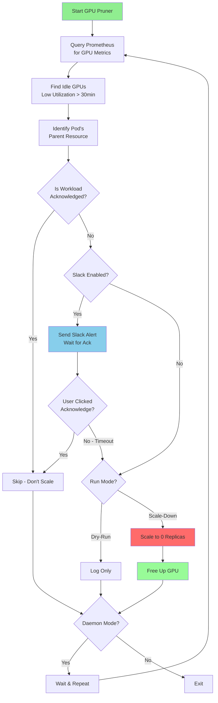

# gpu-pruner

The `gpu-pruner` is a non-destructive idle culler that works with Red Hat OpenShift AI/Kubeflow provided APIs (`InferenceService` and `Notebook`), as well as generic `Deployment`, `ReplicaSet` and `StatefulSet`.

The way it works is by querying cluster NVIDIA DCGM metrics and looking at a window of GPU utilization per pod. A scaling decision is made by looking up the pods metadata, and using owner-references to figure out the owning resource.

**Note:** Requires a K8s service account with CRUD access to the resources in the namespaces that you want to prune.

An [example set of k8s deployment manifests](./gpu-pruner/hack/kustomization.yaml) are available along with the role bindings to run in "cluster mode". 

[prebuilt images](https://github.com/wseaton/gpu-pruner/pkgs/container/gpu-pruner) based on the Dockerfiles in the repository are published to ghcr.io.


## How It Works




## background

The background for `gpu-pruner` is that in certain environments it is very easy for cluster users to request GPUs and then (either accidentally or not accidentally) not consume GPU resources. We needed a method to proactively identify this type of use, and scale down workloads that are idle from the GPU hardware perspective, compared to the default for `Notebook` resources which is web activity. It is totally possible for a user to consume a GPU from a pod PoV but never actually run a workload on it!

This culler politely pauses workloads that appear idle by scaling them down to 0 replicas. Features may be added in the future for better notifications, but the idea is that a user can simply re-enable the workload when they are ready to test/demo again.

## Acknowledgment System

**NEW**: Prevent unwanted scale-downs by acknowledging workloads that are intentionally idle.

Users can acknowledge idle workloads via the web dashboard to prevent gpu-pruner from scaling them down. Use cases:

- Loading large datasets
- Model warm-up / compilation
- Interactive debugging sessions
- Scheduled batch jobs with intermittent GPU usage

**Quick Start:**

1. Open the web dashboard: `http://dashboard-url:8080`
2. Enter your email address
3. Click **4h**, **8h**, or **24h** buttons next to idle workloads
4. Acknowledged workloads won't be scaled down until the acknowledgment expires

**Slack Mentions:**

Get notified directly when your workloads are idle. gpu-pruner supports two methods:

**1. Automatic Namespace Mapping (Recommended)**

Configure a JSON mapping of namespaces to Slack user IDs via environment variable:

```yaml
env:
  - name: SLACK_NAMESPACE_MENTIONS
    valueFrom:
      secretKeyRef:
        name: gpu-pruner-config
        key: namespace-mentions
        optional: true
```

Create the secret with your namespace mappings:

```yaml
apiVersion: v1
kind: Secret
metadata:
  name: gpu-pruner-config
  namespace: fuddin-dev
type: Opaque
stringData:
  namespace-mentions: |
    {
      "fuddin-dev": "<@U123456789>",
      "team-ml-prod": "<@U987654321> <!subteam^S123456>",
      "alice-": "<@UALICE>",
      "bob-": "<@UBOB>"
    }
```

Mapping rules:
- **Exact match**: `"fuddin-dev"` matches namespace `fuddin-dev` exactly
- **Prefix match**: `"alice-"` matches `alice-dev`, `alice-prod`, `alice-test`, etc.
- **Multiple mentions**: Combine user mentions, usergroups, and channel-wide mentions

**2. Per-Workload Annotation (Override)**

Add an annotation to specific deployments to override namespace mapping:

```yaml
apiVersion: apps/v1
kind: Deployment
metadata:
  annotations:
    gpu-pruner.io/slack-mentions: "<@U123456789>"
```

**Precedence:** Annotation > Exact namespace match > Prefix match > No mention

Supports user mentions (`<@USER_ID>`), usergroup mentions (`<!subteam^GROUP_ID>`), and channel-wide mentions (`<!channel>` or `<!here>`). Find your Slack user ID via: Profile → More → Copy member ID.

See [ACKNOWLEDGMENT_GUIDE.md](ACKNOWLEDGMENT_GUIDE.md) for complete documentation, API usage, and troubleshooting.

## Dashboard

The gpu-pruner includes both a **web dashboard** and a **Grafana dashboard** for monitoring GPU workloads.

### Web Dashboard

Real-time web interface for monitoring GPU workloads. See [DASHBOARD.md](DASHBOARD.md) for setup instructions.

Features:

- Real-time monitoring of idle GPU workloads
- **Acknowledgment system** - prevent scale-downs with duration-based acknowledgments
- Resource usage statistics
- Modern web UI with auto-refresh
- REST API endpoint for programmatic access

Enable the dashboard by passing `--dashboard-port`:

```sh
gpu-pruner --dashboard-port=8080 -d --prometheus-url=...
```

### Grafana Dashboard

Import `gpu-dashboard.json` into Grafana for advanced analytics and visualization. The dashboard **auto-refreshes every 30 seconds**.

- **gpu-pruner Activity**: Recent scale-downs, idle candidates from the last pruner check, and query health (requires Prometheus to scrape gpu-pruner `/metrics`; see below)
- **Cluster GPU Overview**: Total GPUs; VRAM and engine-activity partitions (each pair sums to total)
- **GPU Utilization Heatmap**: GPU utilization per node over time
- **Idle GPU Workloads**: Running pods idle for 30+ minutes; rows drop within ~1–2 minutes after scale-down (joined with live GPU requests)
- **Idle GPU Time by Deployment**: Identify which deployments are wasting the most GPU allocation time ([see guide](IDLE_GPU_QUERY.md))
- **GPU Allocation Leaderboard**: Total GPU requests per namespace

**Live updates after scale-down:** Running GPU Workloads and idle workload panels use kube-state-metrics and filter to pods that still request GPUs, so scaled-down workloads disappear within about one to two minutes (kube-state-metrics + Prometheus scrape + dashboard refresh). The 30-minute idle **detection window** is unchanged and still matches gpu-pruner logic; only live visibility of terminated workloads improves.

**gpu-pruner metrics:** gpu-pruner exposes Prometheus metrics on port **8080** at `/metrics` (including `gpu_pruner_scales_total`, `gpu_pruner_idle_gpus`, and scale success counters). Configure a `ServiceMonitor` so your Prometheus instance scrapes the gpu-pruner Service—see `[gpu-pruner/hack/servicemonitor.yaml](gpu-pruner/hack/servicemonitor.yaml)` or the `[user-namespace` overlay](gpu-pruner/hack/overlays/user-namespace/) for namespace-scoped deploys.

See [DASHBOARD.md](DASHBOARD.md) for import instructions and [IDLE_GPU_QUERY.md](IDLE_GPU_QUERY.md) for querying idle GPU time by deployment.

#### Deploy Grafana with Helm

For a complete standalone Grafana deployment with the GPU dashboard pre-configured:

```bash
# Add Grafana Helm repository
helm repo add grafana https://grafana.github.io/helm-charts
helm repo update

# Install Grafana with GPU dashboard
helm install gpu-grafana grafana/grafana \
  -f helm/grafana-values.yaml \
  --set adminPassword='YOUR_SECURE_PASSWORD' \
  --set datasources."datasources\.yaml".datasources[0].url='http://prometheus-k8s.monitoring.svc.cluster.local:9090' \
  -n monitoring --create-namespace
```

See [GRAFANA_DEPLOYMENT.md](GRAFANA_DEPLOYMENT.md) for complete deployment instructions, configuration options, and troubleshooting.

## usage

```sh
Usage: gpu-pruner [OPTIONS] --prometheus-url <PROMETHEUS_URL>

Options:
  -t, --duration <DURATION>
          time in minutes of no gpu activity to use for pruning

          [default: 30]

  -d, --daemon-mode
          daemon mode to run in, if true, will run indefinitely

  -e, --enabled-resources <ENABLED_RESOURCES>
          Specifcy enabled resources with a string of letters

          - `d` for Deployment - `r` for ReplicaSet - `s` for StatefulSet - `i` for InferenceService - `n` for Notebook

          [default: drsin]

  -c, --check-interval <CHECK_INTERVAL>
          interval in seconds to check for idle pods, only used in daemon mode

          [default: 180]

  -n, --namespace <NAMESPACE>
          namespace to use for search filter, is passed down to prometheus as a pattern match
          note: namespaces under bench-guide-* and llm-d-nightly-* are excluded from pruning

  -g, --grace-period <GRACE_PERIOD>
          Seconds of grace period to allow for metrics to be published

          [default: 300]

  -m, --model-name <MODEL_NAME>
          model name of GPU to use for filter, eg. "NVIDIA A10G", is passed down to prometheus as a pattern match

  -r, --run-mode <RUN_MODE>
          Operation mode of the scaler process

          [default: dry-run]
          [possible values: scale-down, dry-run]

      --prometheus-url <PROMETHEUS_URL>
          Prometheus URL to query for GPU metrics eg. "http://prometheus-k8s.openshift-monitoring.svc:9090"

      --prometheus-token <PROMETHEUS_TOKEN>
          Prometheus token to use for authentication, if not provided, will try to authenticate using the service token of the currently logged in K8s user

  -l, --log-format <LOG_FORMAT>
          Log format to use

          [default: default]
          [possible values: json, default, pretty]

      --dashboard-port <DASHBOARD_PORT>
          Enable the web dashboard on the specified port

  -h, --help
          Print help (see a summary with '-h')
```

## OTEL via OTLP

When compiled with the `otel` feature, OTLP metrics and trace export is enabled, and can be configured via environment variables, eg:

```
          env:
            - name: NODE_IP
              valueFrom:
                fieldRef:
                  apiVersion: v1
                  fieldPath: status.hostIP
            - name: OTEL_TRACES_EXPORTER
              value: otlp
            - name: OTEL_METRICS_EXPORTER
              value: otlp
            - name: OTEL_EXPORTER_OTLP_METRICS_ENDPOINT
              value: 'http://$(NODE_IP):4317'
            - name: OTEL_EXPORTER_OTLP_ENDPOINT
              value: 'http://$(NODE_IP):4317'
```

